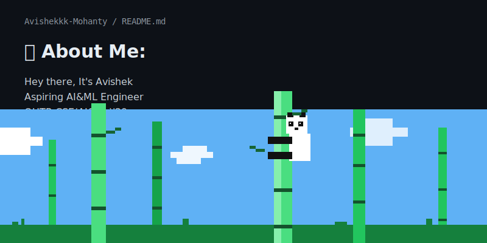

<picture>
  <source media="(prefers-color-scheme: dark)" srcset="./banner.svg">
  
</picture>
## 🌐 Socials:
 

# 💻 Tech Stack:

# 📊 GitHub Stats:
 
 

---

<!-- Proudly created with GPRM ( https://gprm.itsvg.in ) -->
